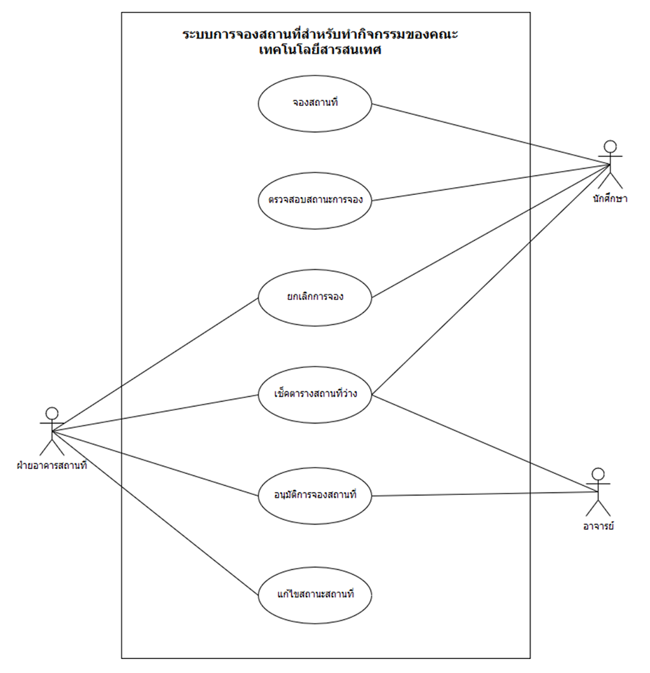

# project

การติดตั้ง 
  1.สิ่งที่ต้องมี: 
    1.1 python version3++ 
    1.2 pip 
    1.3 django 

หลังจากติดตั้งแล้วก็pull projectนี้ลงมา จบ

คำสั่งต่างๆ  
  python manage.py runserver = เปิดport (defaultคือ 8000) 
  django-admin.py startproject <ชื่อไฟล์โปรเจค> = เป็นการสร้างโปรเจคใหม่(ณ ตอนนี้โปรเจคชื่อ blog) 
  python manage.py syncdb = สร้างตารางDB

